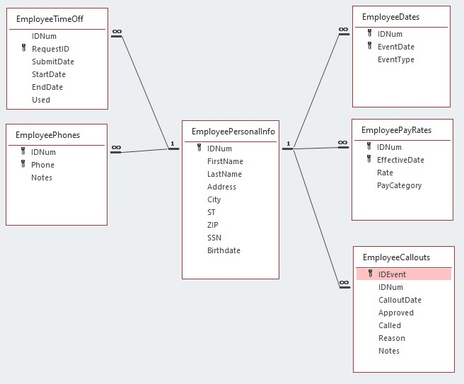
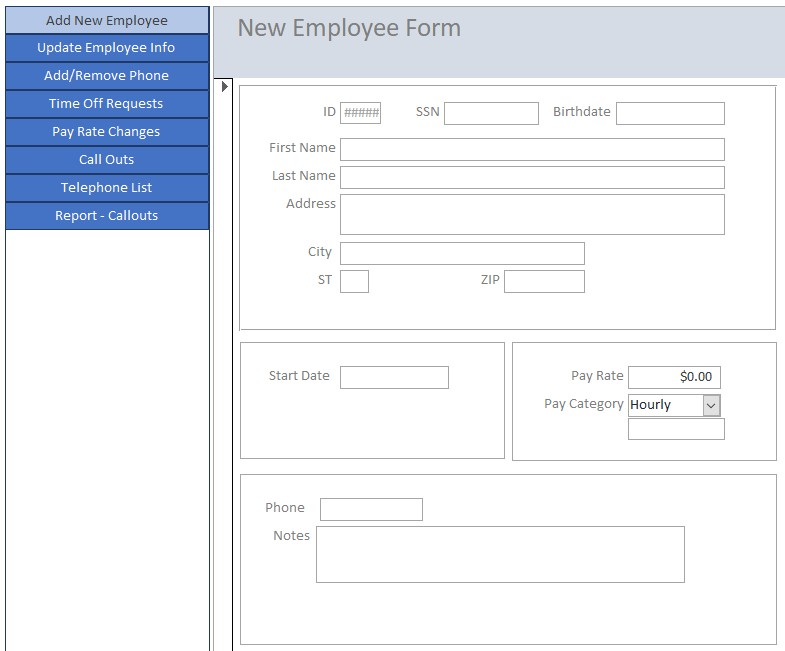
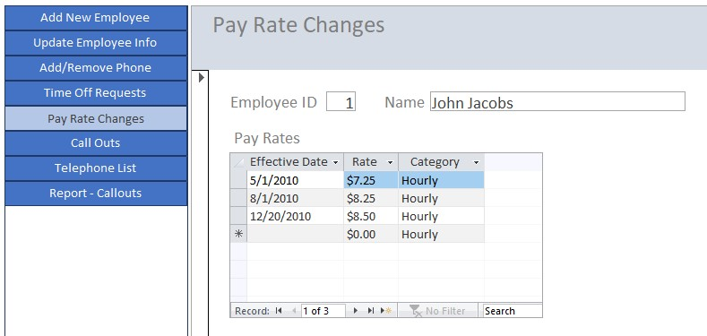
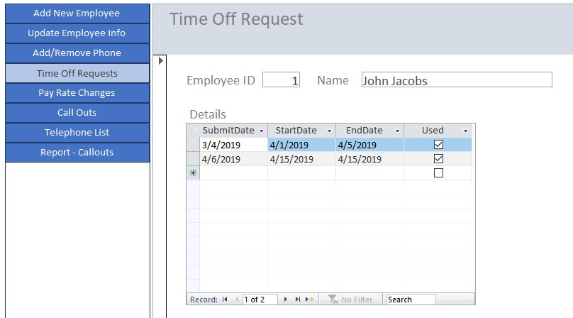
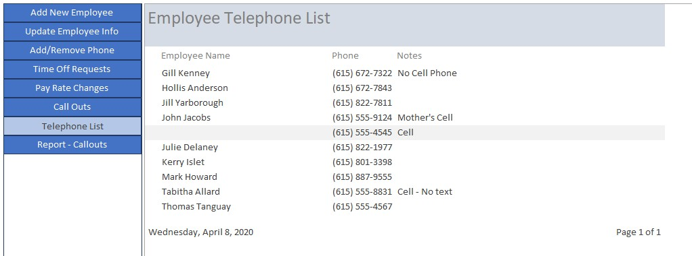
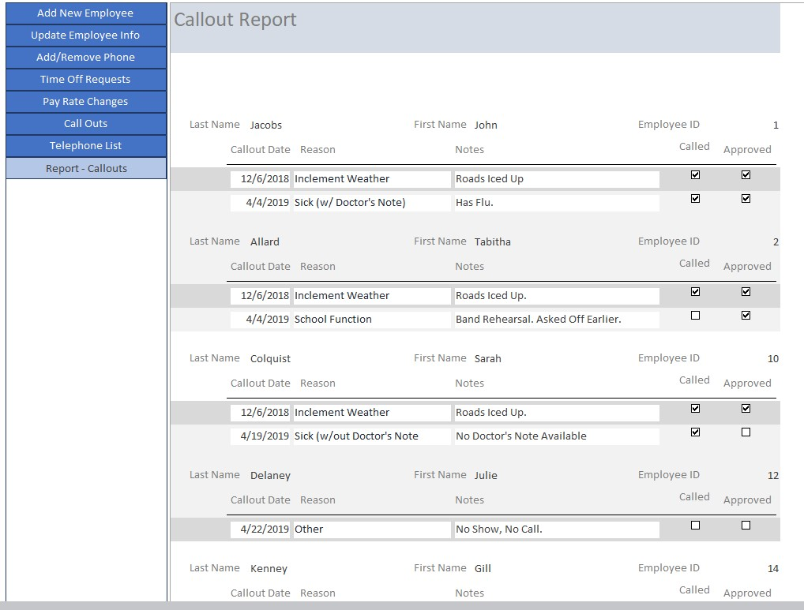

# EmployeeRecords
## An MSAccess Database to keep track of employee information

### Overview

This is an employee database for a small business. It keeps all important information about each employee, including current and previous payrates, requested time off, missed work, etc.

---

*The relationships of the Employee Database*

---

### Entering a New Employee

*The New Employee Info Form*

This form takes employee information and saves the data in the appropriate tables. For example, the pay rate and type are saved in the EmployeePayRates table as seen above, and the the telephone number is saved in the EmployeePhones table, while the personal information such as SSN and Address are stored in the EmployeePersonalInfo table.

---

### Pay Rate Changes

*Pay Rate Changes Form*

This form allows for changing the employee's pay rate (for example, a raise) while also showing the employee's pay rate history. This is useful for remembering when and how often an employee has had a pay rate change (they do ask...). Here you can also change the pay type between hourly and salaried.

---

### Time Off Requests

*Time Off Request Form*

This form allows for employees to request time off. It also keeps track of whether or not the time off was actually used. This is for recalling how many time off requests have been made and how many have been used. Frequently employees want to know how many PTO days they have used. By also keeping the request submit date, we are able to offer time off on a *"first come, first served"* basis.

---

### Telephone List

*Telephone List*

This report is a printable telephone list for active employees. It is helpful to have a printed phone list available for the manager-on-duty to be able to call employees when necessary, as not everyone will access to the database.

---

### Call Out Report

*Call Outs Report*

This report shows each callout event in order by date and employee. It also shows the reason for the callout, and any notes related to the callout. This is useful for enforcing missed days policies, as it keeps an accurate record of every callout. It can also help in making decisions such as granting time off requests and pay raises.
